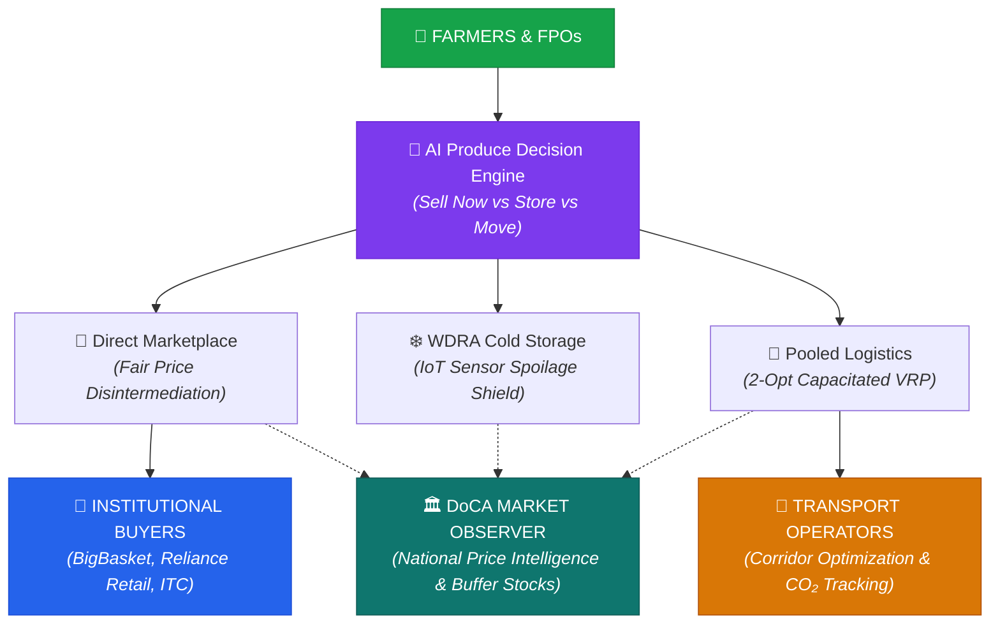

# 🌾 AgriDirect — SIH26033
## Direct Farmer-to-Consumer Market Intelligence, AI Decision Optimizer, Smart Logistics & Price Stabilization Platform

> **Smart India Hackathon 2026** | Ministry of Consumer Affairs, Food & Public Distribution  
> Department of Consumer Affairs (DoCA) | Problem Statement ID: **SIH26033**  
> Repository: [`killerdaku22/Team-Catalyst`](https://github.com/killerdaku22/Team-Catalyst)

---

## 📌 Slide 1 — Executive Summary & The Problem

### The Broken Agricultural Supply Chain in India
India's agricultural supply chain suffers from **3–5 layers of commission agents and speculative middlemen**, leading to systemic market failure:

```mermaid
graph LR
    A["🌾 Farmer (FPO)<br/><b>Receives ₹21.00/kg</b>"] --> B["🏪 Commission Agent (6-10%)"]
    B --> C["📦 APMC Wholesaler (12-18%)"]
    C --> D["🚚 Secondary Distributor (15%)"]
    D --> E["🏬 Urban Retailer (25-40%)"]
    E --> F["🛒 Consumer<br/><b>Pays ₹38.00/kg</b>"]
    
    style A fill:#dc2626,stroke:#991b1b,color:#fff
    style F fill:#dc2626,stroke:#991b1b,color:#fff
    style B fill:#78716c,stroke:#57534e,color:#fff
    style C fill:#78716c,stroke:#57534e,color:#fff
    style D fill:#78716c,stroke:#57534e,color:#fff
    style E fill:#78716c,stroke:#57534e,color:#fff
```



| Systemic Failure | Real-World Economic Impact |
|---|---|
| **Severe Farmer Margin Deprivation** | Smallholders capture only **25%–35%** of the final consumer rupee; distress selling during harvest peaks. |
| **Urban Consumer Price Inflation** | Consumers face **50%–200% markups** on essential perishables (Tomato, Onion, Potato - TOP). |
| **High Post-Harvest Transit Spoilage** | **30%–40% loss** of perishables due to unpooled transport and lack of temperature-aware routing. |
| **Price & Demand Information Asymmetry** | Farmers lack predictive price visibility and don't know whether to **Sell Now, Store in Cold Storage, or Dispatch to Distant Terminals**. |
| **Lack of Real-Time Government Oversight** | Regulators (DoCA, NAFED, NCCF) lack predictive early-warning tools to dispatch strategic buffer stock before retail spikes occur. |

---

## 📌 Slide 2 — Solution Overview: The AgriDirect Ecosystem

**AgriDirect** is a unified, production-hardened platform connecting every link of the agricultural value chain:



> **The Core Result**: Farmers earn **+28.4% more**, consumers save **18.6%**, and the Department of Consumer Affairs gains real-time price surveillance and strategic buffer control.

---

## 📌 Slide 3 — Complete End-to-End Workflow (What We Actually Do)

```
STEP 1: MULTILINGUAL KISAN VOICE ADVISOR (Bhashini AI / Web Speech)
   ↓ Farmer speaks query in Hindi/Kannada/Punjabi/English on mobile
STEP 2: PRODUCE HARVEST ASSESSMENT & DATA QUALITY CLEANING
   ↓ ₹/quintal to ₹/kg conversion, IQR outlier rejection, canonical mandi mapping
STEP 3: 14-DAY MULTI-MODEL DEMAND & PRICE FORECASTING
   ↓ Ridge AR(7) + Holt-Winters + Open-Meteo temperature covariates + walk-forward validation
STEP 4: ECONOMIC DECISION OPTIMIZATION
   ↓ Evaluates 4 actions: SELL_NOW vs STORE (Cold Chamber) vs MOVE (Distant APMC) vs SPLIT
STEP 5: DIRECT CONTRACTING & CONCURRENCY-PROTECTED MARKETPLACE
   ↓ Pessimistic row-level lock (`SELECT FOR UPDATE`), zero double-selling, transparent margin breakdown
STEP 6: CAPACITATED VEHICLE ROUTING & FREIGHT POOLING (2-Opt CVRP)
   ↓ Multi-FPO pickup clustering, pro-rata freight allocation, OSRM road routing, CO₂ footprint reduction
STEP 7: IOT COLD STORAGE TELEMETRY & STRATEGIC BUFFER OVERSIGHT
   ↓ Multi-sensor chamber telemetry (T, RH, Ethylene, CO₂), DoCA buffer stock intervention simulation
STEP 8: CRYPTOGRAPHIC AUDIT LOGGING
   ↓ SHA-256 tamper-evident hash chaining on every financial and regulatory transaction
```

---

## 📌 Slide 4 — The 4 Authoritative Platform Roles

AgriDirect implements a strict server-side **Role-Based Access Control (RBAC)** architecture:

| Role | Target Persona | Primary Cockpit Capabilities | Security Clearance |
|---|---|---|---|
| **🌾 1. FARMER / FPO** | Farmer Producer Organizations & Smallholders | Batch registration, Decision Engine evaluation, Best Market match, Voice Assistant | Read/Write on own produce batches |
| **🏢 2. INSTITUTIONAL BUYER** | Supermarkets, Food Processors, Exporters | Direct Marketplace, Landed Cost Calculator, Forward RFQ Contracts | Read/Write on purchase orders & contracts |
| **🚚 3. TRANSPORT OPERATOR** | Logistics Fleet Managers & Truck Drivers | 2-Opt CVRP Corridor Map, Multi-Stop Pickup Routes, Fuel/CO₂ Savings | Read/Write on vehicle dispatch & routes |
| **🏛️ 4. DOCA MARKET OBSERVER** | Department of Consumer Affairs Price Officers | National Price Surveillance, Early Warning Gluts/Deficits, Buffer Stocks | **Strictly Read-Only** (`403` on mutations) |

---

## 📌 Slide 5 — Deep-Dive: Core Technical & AI Engines

### 🧠 1. Produce Disposition Decision Engine
Solves the fundamental question: *"What should I do with my harvested produce today?"*
* Computes net payoff for **SELL_NOW**, **STORE** in cold storage, **MOVE** to distant terminal APMC, and **SPLIT** (partially sell for immediate liquidity, store remainder).
* Accounts for daily storage rental ($\text{₹}0.08/\text{kg/day}$), spoilage degradation ($0.5\%/\text{day}$), shelf-life limits, and freight haulage costs.

### 📈 2. 14-Day Multi-Model Price & Demand Forecasting
* **Automated Walk-Forward Backtesting**: Evaluates Naive Persistence, 7-Day Moving Average, Holt-Winters Exponential Smoothing, and **Ridge Auto-Regressive AR(7)** models.
* **Weather Telemetry Covariates**: Ingests Open-Meteo ambient temperature and rainfall anomalies to adjust volatility confidence intervals ($\pm 80\%$ and $\pm 95\%$).

### ⚖️ 3. Fair Price & Disintermediation Margin Engine
* Automatically splits consumer savings and farmer uplift with transparent breakdowns:
$$\text{Logistics Cost} = \text{₹}1.50 + (\text{Distance}_{\text{km}} \times \text{₹}0.012/\text{kg/km})$$
$$\text{Farmer Uplift \%} = \frac{\text{Direct Payout} - \text{Middleman Baseline}}{\text{Middleman Baseline}} \times 100$$
$$\text{Consumer Savings \%} = \frac{\text{Retail Benchmark} - \text{Direct Cost}}{\text{Retail Benchmark}} \times 100$$

### 🚛 4. Capacitated Vehicle Routing Problem (2-Opt CVRP) Solver
* Optimizes multi-stop FPO pickup routes under vehicle capacity constraints ($5,000\text{ kg}$ payload).
* Generates turn-by-turn road network geometry via **OSRM API** (with Haversine geodesic fallback).
* Computes certified carbon reductions: $\Delta\text{CO}_2 = (\text{Dist}_{\text{unpooled}} - \text{Dist}_{\text{pooled}}) \times W \times 0.162\text{ kg CO}_2/\text{tonne-km}$.

### ❄️ 5. Cold Storage IoT Telemetry & DoCA Buffer Intervention
* Simulates multi-sensor chamber telemetry ($\text{Temperature}$, $\text{Relative Humidity}$, $\text{Ethylene } \text{C}_2\text{H}_4$, $\text{CO}_2$).
* Models National Price Monitoring Cell market intervention: predicts retail price cooling percentage upon strategic buffer release.

---

## 📌 Slide 6 — Concurrency Locking & Data Provenance Standard

### 🔒 Pessimistic Row-Level Locking (`SELECT FOR UPDATE`)
* **Problem**: In high-demand agricultural markets, two institutional buyers clicking "Buy" at the same millisecond could cause inventory over-allocation.
* **Solution**: Implemented `db.query(CropListing).with_for_update().first()`. The database locks the produce row during checkout, decrements inventory atomically, and rejects over-orders with `400 Bad Request`.

### 🛡️ Interactive Data Provenance & Trust Popovers
* Every metric and forecast exposes an interactive **Data Provenance Badge**:
  * **`LIVE_OBSERVED`**: Real-time Agmarknet / Open-Meteo telemetry.
  * **`CACHED_BENCHMARK`**: In-memory TTL cache with fallback resilience.
  * **`MODEL_INFERENCE`**: Multi-model backtested regression output.
  * **`REAL_ROAD_NETWORK`**: OSRM OpenStreetMap routing corridor.

---

## 📌 Slide 7 — Verification, Stress Benchmarks & Codebase Metrics

```
┌────────────────────────────────────────────────────────────────────────────────────────┐
│                               VERIFIED SYSTEM PERFORMANCE                              │
├────────────────────────────────────────────────────────────────────────────────────────┤
│ • Automated Pytest Coverage       : 76 / 76 Test Suites Passing (100% Success)         │
│ • Fair Price Engine Throughput    : 512.7 Requests / sec (P95 Latency: 24.07 ms)       │
│ • Decision Engine Throughput      : 203.8 Requests / sec (P95 Latency: 6.16 ms)        │
│ • High-Contention Race Test       : 20 Concurrent Buyers on 1,000 kg (0 Oversold)      │
│ • Cryptographic Audit Chain       : SHA-256 Tamper-Evident Verification (Zero Breaks)   │
│ • Secret Leakage Audit            : 0 Hardcoded Credentials in Frontend Distribution   │
│ • Frontend Production Bundle      : Clean Vite Build in 11.12s (0 TypeScript Errors)   │
└────────────────────────────────────────────────────────────────────────────────────────┘
```

---

## 📌 Slide 8 — Jury Demonstration Flow (Script for Live Pitch)

### 🎙️ Action 1: Kisan Voice Assistant
* Tap the floating **"किसान आवाज़ AI (Voice)"** assistant in Hindi.
* Ask: *"क्या मुझे टमाटर अभी बेचना चाहिए या कोल्ड स्टोरेज में रखना चाहिए?"*
* Voice Assistant parses intent, calls the Decision Engine, and reads aloud the optimal recommendation with profit uplift.

### 🌾 Action 2: Produce Batch Decision Cockpit
* As **Farmer / FPO**, select Tomato ($4,000\text{ kg}$) at Kolar Hub.
* Observe the interactive waterfall breakdown: Sell Now ($\text{₹}1,04,000$) vs Store ($\text{₹}1,18,800$) vs Move to Bengaluru ($\text{₹}1,28,320$).

### 🏢 Action 3: Buyer Direct Checkout with Concurrency Protection
* Switch to **Institutional Buyer**, view direct tomato listing, inspect Fair Price margin breakdown, and place order.
* Demonstrate atomic inventory decrement and middleman disintermediation savings.

### 🚛 Action 4: Logistics Pooled Corridor Dispatch
* Switch to **Transport Operator**, view multi-farm pickup routes on Leaflet map, inspect 2-Opt road geometry, freight savings, and CO₂ reduction counter.

### 🏛️ Action 5: DoCA Market Observer (Read-Only Price Surveillance)
* Switch to **DoCA Market Observer**, view national early-warning gluts, simulate strategic buffer stock release from Nashik Silos, and demonstrate read-only authorization enforcement (`403 Forbidden` on mutation).

---

## 📌 Slide 9 — Summary & Impact

```
             FARMERS                              CONSUMERS                          GOVERNMENT
     ↑ +28.4% Higher Payout               ↓ −18.6% Cheaper Produce            🏛️ Real-Time Intelligence
     🚫 No APMC Middlemen                 🏷️ 100% Price Transparency         🛡️ Strategic Price Cooling
     ❄️ Spoilage Risk Reduced             🌱 Fresh, Graded Harvest            🌿 12,450 kg CO₂ Saved
```

**AgriDirect: Empowering India's Farmers, Protecting Consumers, and Stabilizing National Agricultural Markets.**
